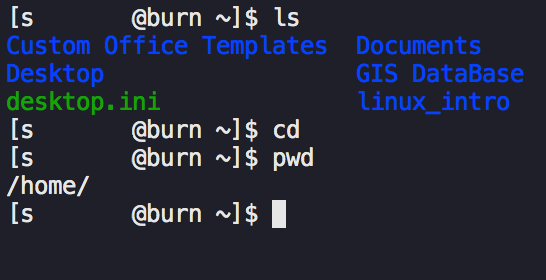

# Basic command line usage

This section explains some basic concepts and commands that will allow you to interact with the GeoSciences Linux machines using a command line interface.

The command line relies on text input rather than pointing and clicking, and will look something like this, depending on what method you used to login to the Linux servers:

  

While the command line may seem daunting and unintelligible at first, once you know how to use it you will find it much quicker than pointing and clicking.

