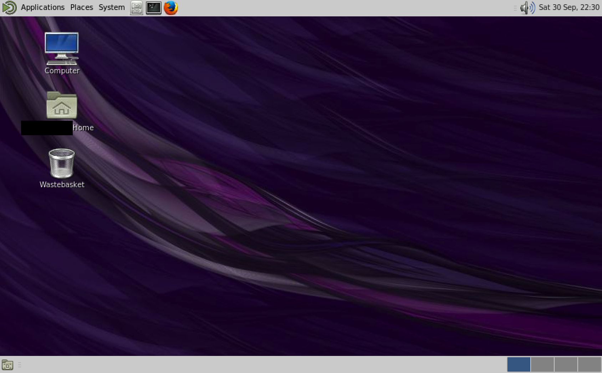

# Login

There are three main ways to access systems running Linux in the School of GeoSciences:

* Login directly to a GeoSciences Linux workstation and use an ssh terminal to connect to a specific server if required
* Login to a GeoSciences Windows machine and connect to the GeoSciences Linux XRDP service using Remote Desktop
* Login to the GeoSciences Linux XRDP service from your personal computer using Remote Desktop or similar XRDP client

By far the most common way to access Linux is to use a GeoSciences Windows machine and connect to a Linux server with Remote Desktop, though using a personal computer or laptop is becoming more popular.

Most of the tasks you will need to use a Linux server for can be achieved through a command line interface like the one in the picture below:

But you can also login using a conventional graphical user interface. Some programs even require a graphical user interface \(GUI\), which on GeoSciences systems looks like the image below:

