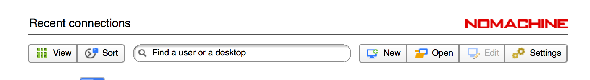
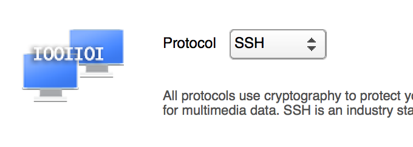
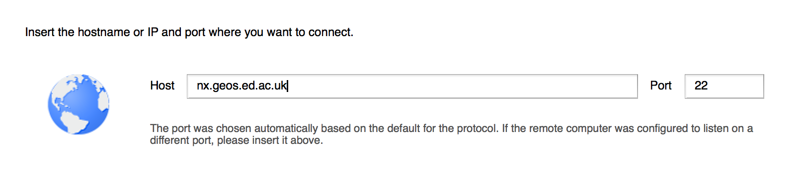
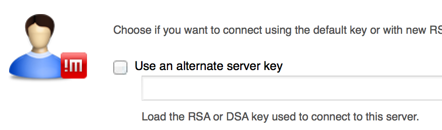
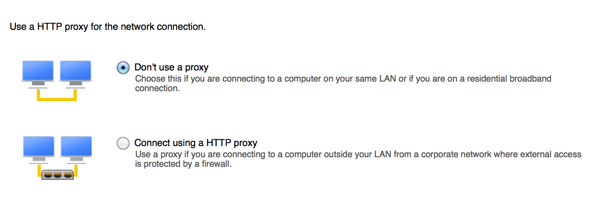
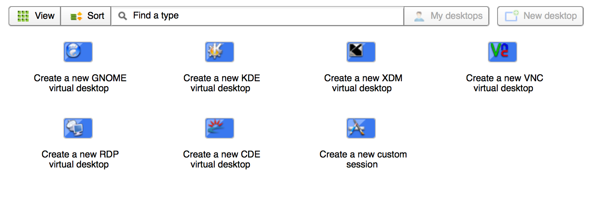

# GUI - personal windows, Mac, Linux

Download NoMachine from \([https://www.nomachine.com/download\)\[https://www.nomachine.com/download](https://www.nomachine.com/download%29[https://www.nomachine.com/download)\]

Connect to the University VPN \([more information can be found here](http://www.ed.ac.uk/information-services/computing/desktop-personal/vpn)\).

Open NoMachine

Create a new connection:

Select Protocol: `SSH`

Type Host: `nx.geos.ed.ac.uk`, Port: `22`

Select "Use NoMachine login"

Make sure "Use an alternate server key" is left unchecked and blank

Select "Don't use a proxy"

Give the connection a sensible name

Select the new connection from the list on the main menu, click `Connect` and select a desktop environment such as `KDE`. Desktop environments merely affect the way the desktop is presented, the colour of the window borders and application icons etc. All the underlying functionality of Linux will remain exactly the same regardless of the desktop environment.

When prompted for a username and password enter your UUN \(e.g. `s1234567`\) and use the password you use to login to MyEd.

